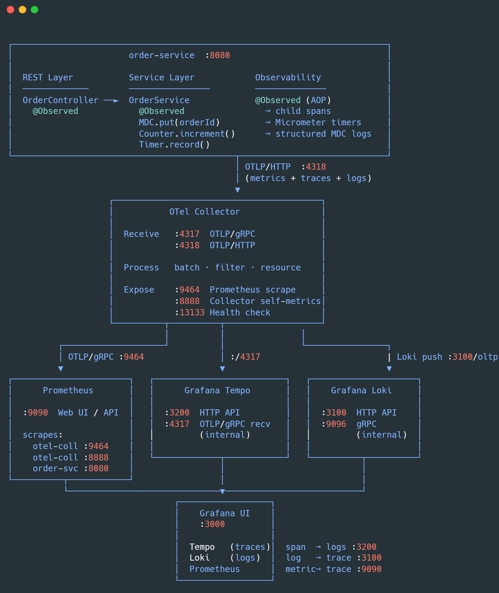

# Order Service — Spring Boot 4 + OpenTelemetry

Production-ready sample application demonstrating the **three pillars of observability** —
metrics, distributed traces, and logs — using the native Spring Boot 4 OpenTelemetry starter
and the Grafana LGTM observability stack.

---

## Architecture



---

## Signal Overview

| Signal      | App exports to               | Collector exports to                 | Backend port | Grafana query         |
|-------------|------------------------------|--------------------------------------|:------------:|-----------------------|
| **Metrics** | OTLP/HTTP `:4318/v1/metrics` | Prometheus scrape exporter `:9464`   | `:9090`      | PromQL / dashboards   |
| **Traces**  | OTLP/HTTP `:4318/v1/traces`  | OTLP/gRPC → Tempo `:4317` (internal) | `:3200`      | TraceQL / service map |
| **Logs**    | OTLP/HTTP `:4318/v1/logs`    | Loki push `:3100/oltp`               | `:3100`      | LogQL                 |

---

## Quick Start

### Prerequisites
- Java 21+
- Maven 3.9+
- Docker & Docker Compose

### 1. Start the observability stack

```bash
docker compose up -d prometheus tempo loki otel-collector grafana
```

Wait ~15 seconds for all services to become healthy:

```bash
docker compose ps
```

### 2. Run the application

```bash
./mvnw spring-boot:run
```

Or with the production profile (requires `DB_URL`, `DB_USERNAME`, `DB_PASSWORD` env vars):

```bash
SPRING_PROFILES_ACTIVE=production ./mvnw spring-boot:run
```

### 3. Generate traffic

```bash
# Create an order
curl -s -X POST http://localhost:8080/api/v1/orders \
  -H 'Content-Type: application/json' \
  -d '{
    "customerId":  "CUST-001",
    "productId":   "PROD-XYZ",
    "productName": "Wireless Keyboard",
    "quantity":    2,
    "unitPrice":   1499.99
  }' | jq .

# List orders
curl -s http://localhost:8080/api/v1/orders | jq .

# Update status (replace <ID> with the id from the create response)
curl -s -X PUT http://localhost:8080/api/v1/orders/<ID>/status \
  -H 'Content-Type: application/json' \
  -d '{"status": "CONFIRMED"}' | jq .

# Cancel an order
curl -s -X PUT http://localhost:8080/api/v1/orders/<ID>/status \
  -H 'Content-Type: application/json' \
  -d '{"status": "CANCELLED", "reason": "Customer request"}' | jq .
```

### 4. Explore in Grafana

Open **http://localhost:3000** (no login required for the local stack).

| Goal                        | Steps                                                               |
|-----------------------------|---------------------------------------------------------------------|
| View traces                 | Explore → Tempo → Search → service.name = order-service            |
| View logs                   | Explore → Loki → `{service_name="order-service"}`                  |
| Jump log → trace            | Any log line with `traceId=…` → click "View trace in Tempo"         |
| Jump trace → logs           | Open any span → Logs tab → "Find logs for this span"                |
| View metrics                | Explore → Prometheus → `orders_created_total`                       |
| View application health     | http://localhost:8080/actuator/health                               |

---

## Key Observability Patterns Used

### @Observed (AOP — automatic spans + timers)

```java
@Observed(
    name = "order.create",
    contextualName = "create-order",
    lowCardinalityKeyValues = {"layer", "service"}
)
public Order createOrder(CreateOrderRequest req) { … }
```

Creates a child span in the active trace and a Micrometer timer named
`order.create` — zero boilerplate.

### Structured MDC Logging (log ↔ trace correlation)

```java
MDC.put("order_id",     saved.getId().toString());
MDC.put("order_status", saved.getStatus().name());
log.info("Order created successfully");
MDC.remove("order_id");
```

The OTel Logback appender captures all MDC entries as log record attributes,
making them filterable in Loki: `{service_name="order-service"} | order_id = "…"`

### Custom Counters and Timers

```java
// Counter — drives alerts ("order cancellation rate > 5%")
ordersCancelledCounter.increment();

// Per-dimension counter — enables per-product funnel dashboards
meterRegistry.counter("orders.created.by.product",
                       "product_id", saved.getProductId()).increment();

// Timer with percentile histogram — P95 latency SLO monitoring
Timer.record(() -> { /* business logic */ });
```

### Status-transition Counter (funnel analysis)

```java
meterRegistry.counter("orders.status.transition",
    "from", previousStatus.name(),
    "to",   req.getStatus().name()).increment();
```

Enables a Sankey/flow diagram in Grafana: PENDING → CONFIRMED → SHIPPED → …

### Gauges refreshed on schedule

```java
@Scheduled(fixedRateString = "…")
void refreshOrderGauges(…) {
    pendingOrdersGauge.set(repo.countByStatus(PENDING));
}
```

Alerts fire when the pending queue grows beyond a threshold — classic
production canary metric.

---

## Project Structure

```
order-service/
├── Dockerfile
├── docker-compose.yml
├── otel-collector-config.yml       # OTel Collector fan-out config
├── prometheus.yml
├── tempo.yml
├── loki-config.yml
├── grafana/
│   └── provisioning/
│       └── datasources/
│           └── datasources.yml    # Prometheus + Tempo + Loki auto-provisioned
└── src/main/
    ├── java/com/example/orderservice/
    │   ├── OrderServiceApplication.java
    │   ├── config/
    │   │   └── ObservabilityConfig.java   # ObservedAspect + custom metrics beans
    │   ├── controller/
    │   │   └── OrderController.java
    │   ├── dto/
    │   │   ├── CreateOrderRequest.java
    │   │   └── UpdateOrderStatusRequest.java
    │   ├── exception/
    │   │   ├── OrderNotFoundException.java
    │   │   └── GlobalExceptionHandler.java
    │   ├── model/
    │   │   └── Order.java
    │   ├── repository/
    │   │   └── OrderRepository.java
    │   └── service/
    │       └── OrderService.java          # @Observed, MDC, counters, timers
    └── resources/
        ├── application.yml                # full OTel + profile config
        └── logback-spring.xml             # OTel Logback appender + console
```

---

## Switching to a Real Database (Production)

1. Add PostgreSQL driver to `pom.xml`:
   ```xml
   <dependency>
       <groupId>org.postgresql</groupId>
       <artifactId>postgresql</artifactId>
       <scope>runtime</scope>
   </dependency>
   ```

2. Override the datasource in `application.yml` under `spring.config.activate.on-profile: production`
   or via environment variables:
   ```
   DB_URL=jdbc:postgresql://db:5432/orders
   DB_USERNAME=orders_app
   DB_PASSWORD=<secret>
   ```

3. Set `spring.jpa.hibernate.ddl-auto=validate` and manage schema with Flyway:
   ```xml
   <dependency>
       <groupId>org.flywaydb</groupId>
       <artifactId>flyway-database-postgresql</artifactId>
   </dependency>
   ```

---

## Known Issues / Notes

- **logback appender version**: Versions `2.26.x+` of `opentelemetry-logback-appender-1.0`
  cause a `NoSuchMethodError` with Spring Boot 4.0.6 due to an OTel API version mismatch
  (`1.55.x` vs `1.61+`). Pinned to `2.21.0-alpha` until Spring Boot ships a BOM fix.
  Track: https://github.com/spring-projects/spring-boot/issues/50251

- **Tracing sample rate**: Set `TRACING_SAMPLE_RATE=0.1` in production for 10% sampling.
  Head-based sampling in the OTel Collector can provide more sophisticated strategies.